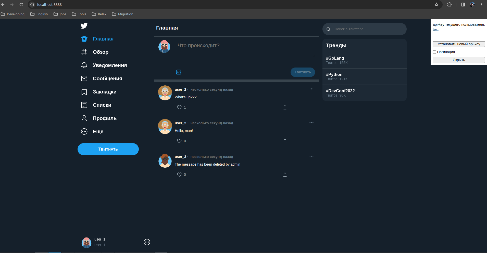

# Проект "A tweeter clone"

## Описание

A tweeter clone - это RESTful API для создания и управления социальными медиа-платформами. 
API предоставляет функционал для создания и управления пользователями, твитами, лайками, медиафайлами и подписками.

## Демо

* [Документация API (Swagger)](http://localhost:8000/docs)

## Технологии

* Python - основной язык программирования
* FastAPI - фреймворк для создания API на Python
* SQLAlchemy - ORM для работы с базой данных
* PostgreSQL - база данных для хранения данных
* pytest-asyncio - библиотека для написания асинхронных тестов
* Docker - контейнеризация приложения

## Уникальные особенности

* Асинхронное программирование для обеспечения высокой производительности API
* Использование SQLAlchemy для работы с базой данных с помощью ORM
* Встроенная поддержка загрузки медиафайлов и их управление через API

## Техническое описание проекта

### Установка

1. Склонировать репозиторий: git clone https://github.com/AlekseySavrasov/a_tweeter_clone.git
2. Перейти в директорию проекта: cd a_tweeter_clone

### Настройка

1. Создайте файл «.env» в корневом каталоге.
2. Заполните ".env", например ".evn.example", используя свои учетные данные.

### Запуск

1. В терминале проекта выполните команду «docker-compose up -d».
2. В браузере откройте ссылку http://localhost:8888/.

## Авторы

* Алексей Саврасов - [@aleksei_savrasov](https://github.com/AlekseySavrasov)
